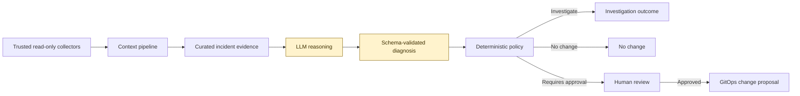
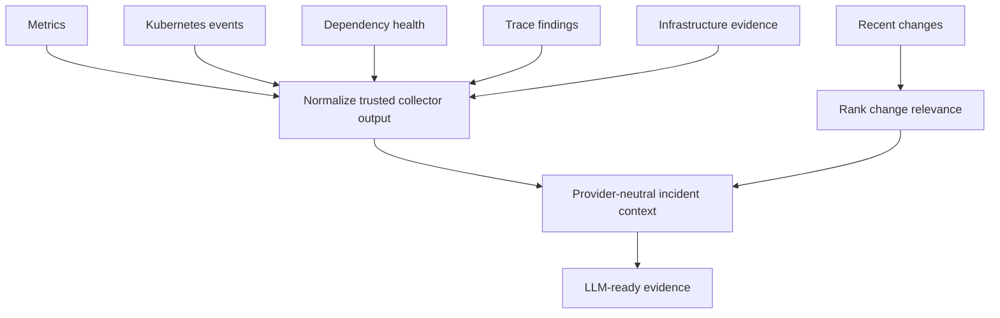
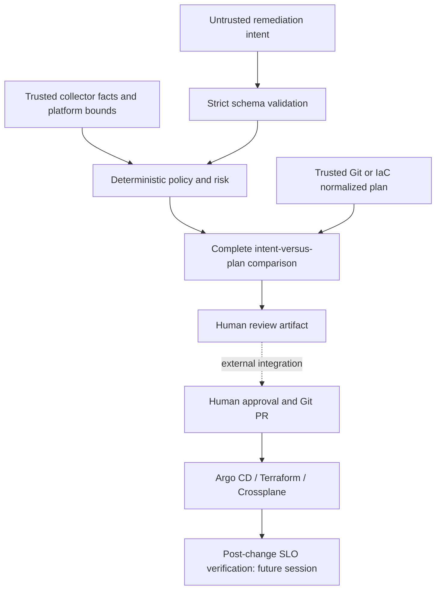

# AI Incident Triage Copilot

AI Incident Triage Copilot is a safety-first foundation for turning incident evidence into structured, reviewable remediation proposals. It keeps reasoning separate from authority: an LLM may analyze evidence and propose an action, but deterministic policy controls what can proceed.

```
read-only incident context -> structured LLM diagnosis -> deterministic policy -> human-approved GitOps change
```

The project intentionally has **no Kubernetes credentials, no `kubectl` integration, and no production mutation capability**. A rollback is represented only as a proposed GitOps change and always requires human approval.

## Architecture



The LLM can reason about evidence, but it cannot enact changes. Policy validation and human approval form the authority boundary before any GitOps proposal is created.

## Requirements

Python 3.11 or newer.

## Run a policy evaluation

```bash
PYTHONPATH=src python3 -m incident_copilot \
  --context examples/checkout_503_context.json \
  --diagnosis examples/checkout_503_diagnosis.json
```

The expected decision is `requires_human_approval`, with a proposed Git change to return `checkout-api` to `v2.18.4`.

## Build incident context

The context pipeline converts trusted collector output into compact, provider-neutral evidence for LLM reasoning. It normalizes metrics, Kubernetes events, dependency health, traces, infrastructure evidence, and recent changes.

```bash
PYTHONPATH=src python3 -m incident_copilot.context_cli \
  --input examples/checkout_incident_evidence.json
```

Recent changes are ranked by temporal proximity, dependency overlap, blast radius, and metric correlation. These scores indicate relevance for investigation; they do not establish causality.



## Safety model

- Collector input is read-only and normalized before it reaches a reasoning layer.
- Diagnoses are schema-validated before policy evaluation.
- Confidence below `0.80` is routed to investigation.
- Rollbacks require human approval and result in a GitOps change proposal, never a direct production action.
- Actions outside the permitted policy default to no change.

## Test suite

```bash
PYTHONPATH=src python3 -m unittest discover -s tests -v
```

## Session 3: safe remediation proposals

The new controller boundary accepts `SCALE`, `ROLLBACK`, and a deliberately narrow
`CONFIG_CHANGE` contract. It produces local review artifacts only. It never creates
PRs, obtains credentials, calls Kubernetes, or applies infrastructure changes.
The earlier diagnosis CLI remains available for Session 1/2 examples; use the
Session 3 CLI for the additional safety checks below.



Run the payments scaling challenge:

```bash
.venv/bin/python -m incident_copilot.remediation_cli \
  --intent examples/remediation/payments_scale_intent.json \
  --context examples/remediation/payments_context.json
```

This returns `investigate`: scaling 10 → 16 exceeds HPA maxReplicas 10. The lesson
contains both 8 and 10 current replicas; this fixture explicitly assumes a trusted
collector has reconciled the latest count to 10. If `current_state.replicas` and
`observed_replicas` disagree, the evaluator requests investigation first.

A separate HPA proposal can be reviewed after the reason for the existing limit,
load testing, dependency capacity, quota, schedulability, and cost have been checked:

```bash
.venv/bin/python -m incident_copilot.remediation_cli \
  --intent examples/remediation/hpa_intent.json \
  --context examples/remediation/reviewed_hpa_context.json \
  --plan examples/remediation/hpa_plan.json
```

This returns `requires_human_approval` with high risk and senior approval. The
reviewed context is **synthetic demonstration evidence**, not proof of real
capacity. Replace the plan with `examples/remediation/unexpected_plan.json` to see
an unrelated NetworkPolicy deletion denied. Omit `--plan` to get `requires_plan`;
this preliminary change description is not ready for approval or execution.

The intent requires `action`, `resource`, `namespace`, `environment`, one-field
`desired_state`, `confidence`, nonempty `evidence`, and a `rollback_plan` restoring
the trusted old value. Unknown fields, extra desired-state changes, invalid numbers,
and unsupported actions are rejected. Deletion and database mutations are outside
this allowlist. Read-only data collection remains outside the mutation API.

| Intent field | Deterministic controls | Review |
| --- | --- | --- |
| `replicas` | At most 2× current; within HPA and platform bounds; DB utilization ≤80%; capacity, quota, dependency, and cost checks | Operator |
| `image.tag` | Trusted known-good version, regression evidence, healthy dependencies | Senior |
| `hpa.maxReplicas` | Capacity checks plus review of existing limit and load-test ceiling | Senior |
| `node_pool.max_nodes` | Same capacity checks, plus pending pods due to insufficient CPU | Senior |
| `memory.limitMi` | At most 2× current; saturation, OOMKills, leak ruled out, schedulability, quota, cost, existing-limit and memory-request review | Senior |

All mutations require approval, including development changes in this conservative
starter policy. Every action also checks target identity, confidence ≥0.80, blast
radius, and rollback feasibility. Missing or failed evidence requests investigation;
violations of hard limits deny the proposal. Increasing a memory limit does not
change its scheduling request: `memory_request_reviewed` must attest that the
requests and node headroom are adequate. Required evidence checks are platform
attestations, not facts inferred from the model's explanation.

### Trust and integration contract

Supply intent from the model, context from trusted collectors/platform policy, and
the plan from trusted tooling. Never let the model write the context's approved
bounds, evidence-check booleans, target identity, blast-radius estimates, or plan.
The CLI reads local files and cannot authenticate their provenance; enforcing that
separation belongs to the caller. Collector freshness must also be enforced there.

A plan is an object with a `changes` array. Every change includes resource,
namespace, environment, repository path, controller, operation, field, before, and
after values. The evaluator compares the **entire** array to exactly one authorized
update, rejecting additional, missing, duplicate, replacement, or mismatched
changes. It does not parse raw Terraform plans or Kubernetes manifests. A future
adapter must normalize the complete deterministic plan without dropping deletions,
unknown values, side effects, or changes to other resources. Unsupported plan
shapes fail closed. Crossplane or Terraform selection only labels the intended
controller; this project invokes neither.

Approval is not accepted as model input, and a successful policy result is not an
execution credential. An external approval service must bind approval to the exact
reviewed intent, context, plan, and repository revision, re-evaluate after changes,
and submit through the owning controller. RBAC, authenticated approvals, PR
creation, raw-plan adapters, and post-change verification are integration work,
not implemented runtime capabilities. Next session's verifier should compare the
original SLO symptoms before and after the change and watch for new regressions.

CLI exit codes: `0` for a review artifact (`requires_plan` or
`requires_human_approval`), `1` for `deny`/`investigate`, and `2` for malformed input.
No exit code grants permission to apply.
