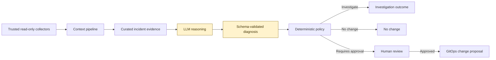
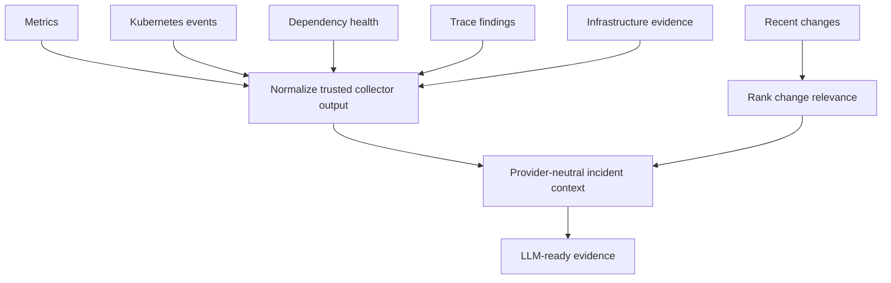

# AI Incident Triage Copilot

AI Incident Triage Copilot is a safety-first foundation for turning incident evidence into structured, reviewable remediation proposals. It keeps reasoning separate from authority: an LLM may analyze evidence and propose an action, but deterministic policy controls what can proceed.

```
read-only incident context -> structured LLM diagnosis -> deterministic policy -> human-approved GitOps change
```

The project intentionally has **no Kubernetes credentials, no `kubectl` integration, and no production mutation capability**. A rollback is represented only as a proposed GitOps change and always requires human approval.

## Architecture



The LLM can reason about evidence, but it cannot enact changes. Policy validation and human approval form the authority boundary before any GitOps proposal is created.

## Requirements

Python 3.11 or newer.

## Run a policy evaluation

```bash
PYTHONPATH=src python3 -m incident_copilot \
  --context examples/checkout_503_context.json \
  --diagnosis examples/checkout_503_diagnosis.json
```

The expected decision is `requires_human_approval`, with a proposed Git change to return `checkout-api` to `v2.18.4`.

## Build incident context

The context pipeline converts trusted collector output into compact, provider-neutral evidence for LLM reasoning. It normalizes metrics, Kubernetes events, dependency health, traces, infrastructure evidence, and recent changes.

```bash
PYTHONPATH=src python3 -m incident_copilot.context_cli \
  --input examples/checkout_incident_evidence.json
```

Recent changes are ranked by temporal proximity, dependency overlap, blast radius, and metric correlation. These scores indicate relevance for investigation; they do not establish causality.



## Safety model

- Collector input is read-only and normalized before it reaches a reasoning layer.
- Diagnoses are schema-validated before policy evaluation.
- Confidence below `0.80` is routed to investigation.
- Rollbacks require human approval and result in a GitOps change proposal, never a direct production action.
- Actions outside the permitted policy default to no change.

## Test suite

```bash
PYTHONPATH=src python3 -m unittest discover -s tests -v
```
