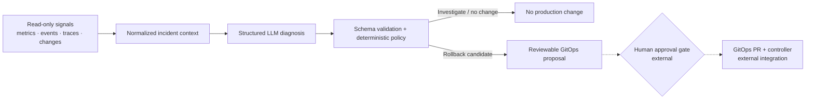
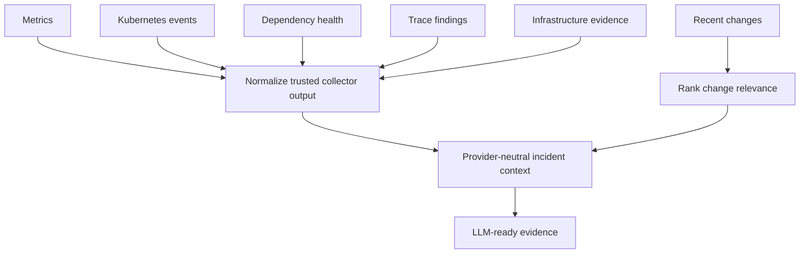
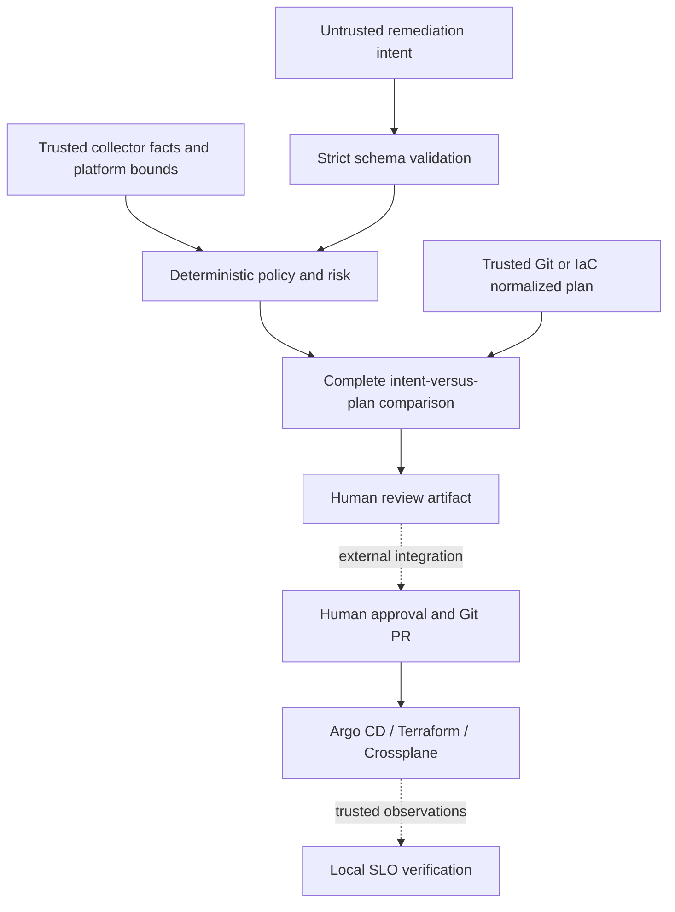

# AI Incident Triage Copilot

AI Incident Triage Copilot is a safety-first foundation for turning incident evidence into structured, reviewable remediation proposals. It keeps reasoning separate from authority: an LLM may analyze evidence and propose an action, but deterministic policy controls what can proceed.

```
read-only incident context -> structured LLM diagnosis -> deterministic policy -> human-approved GitOps change
```

The project intentionally has **no Kubernetes credentials, no `kubectl` integration, and no production mutation capability**. A rollback is represented only as a proposed GitOps change and always requires human approval.

## Development stages

The co-pilot is built in stages. Each stage adds one capability while keeping
model reasoning separate from policy and production authority.

| Stage | Capability | Current state |
| --- | --- | --- |
| 1 | Structured incident triage and deterministic rollback policy | Available |
| 2 | Read-only context normalization and evidence ranking | Available |
| 3 | Safe remediation intents, plan comparison, and review artifacts | Available |
| 4 | Post-change SLO verification | Available |

## Architecture


```mermaid
flowchart LR
    Signals[Read-only signals<br/>metrics · events · traces · changes] --> Context[Normalized incident context]
    Context --> Diagnosis[Structured LLM diagnosis]
    Diagnosis --> Policy[Schema validation + deterministic policy]
    Policy -->|Investigate / no change| Stop[No production change]
    Policy -->|Rollback candidate| Proposal[Reviewable GitOps proposal]
    Proposal -.-> Gate{Human approval gate<br/>external}
    Gate -.-> GitOps[GitOps PR + controller<br/>external integration]
```

The LLM can reason about evidence, but it cannot enact changes. This project produces a proposal for review; approval, PR creation, and controller execution require external integration.

## Requirements

Python 3.11 or newer.

## Stage 1: triage and policy evaluation

```bash
PYTHONPATH=src python3 -m incident_copilot \
  --context examples/checkout_503_context.json \
  --diagnosis examples/checkout_503_diagnosis.json
```

The expected decision is `requires_human_approval`, with a proposed Git change to return `checkout-api` to `v2.18.4`.

## Stage 2: incident context and evidence

The context pipeline converts trusted collector output into compact, provider-neutral evidence for LLM reasoning. It normalizes metrics, Kubernetes events, dependency health, traces, infrastructure evidence, and recent changes.

```bash
PYTHONPATH=src python3 -m incident_copilot.context_cli \
  --input examples/checkout_incident_evidence.json
```

Recent changes are ranked by temporal proximity, dependency overlap, blast radius, and metric correlation. These scores indicate relevance for investigation; they do not establish causality.


```mermaid
flowchart TD
    Metrics[Metrics] --> Normalize[Normalize trusted collector output]
    Events[Kubernetes events] --> Normalize
    Dependencies[Dependency health] --> Normalize
    Traces[Trace findings] --> Normalize
    Infrastructure[Infrastructure evidence] --> Normalize
    Changes[Recent changes] --> Rank[Rank change relevance]
    Normalize --> Context[Provider-neutral incident context]
    Rank --> Context
    Context --> Reasoning[LLM-ready evidence]
```

## Stage 3: safe remediation proposals

The remediation boundary accepts `SCALE`, `ROLLBACK`, and a deliberately narrow
`CONFIG_CHANGE` contract. It produces local review artifacts only. It never creates
PRs, obtains credentials, calls Kubernetes, or applies infrastructure changes.
The Stage 1 diagnosis CLI remains available; use the remediation CLI for the
additional safety checks below.


```mermaid
flowchart TD
    Intent[Untrusted remediation intent] --> Schema[Strict schema validation]
    Facts[Trusted collector facts and platform bounds] --> Policy[Deterministic policy and risk]
    Schema --> Policy
    Policy --> Diff[Complete intent-versus-plan comparison]
    Plan[Trusted Git or IaC normalized plan] --> Diff
    Diff --> Review[Human review artifact]
    Review -. external integration .-> Approval[Human approval and Git PR]
    Approval --> Controller[Argo CD / Terraform / Crossplane]
    Controller -. trusted observations .-> Verification[Local SLO verification]
```

Run the payments scaling challenge:

```bash
.venv/bin/python -m incident_copilot.remediation_cli \
  --intent examples/remediation/payments_scale_intent.json \
  --context examples/remediation/payments_context.json
```

This returns `investigate`: scaling 10 → 16 exceeds HPA maxReplicas 10. The lesson
contains both 8 and 10 current replicas; this fixture explicitly assumes a trusted
collector has reconciled the latest count to 10. If `current_state.replicas` and
`observed_replicas` disagree, the evaluator requests investigation first.

A separate HPA proposal can be reviewed after the reason for the existing limit,
load testing, dependency capacity, quota, schedulability, and cost have been checked:

```bash
.venv/bin/python -m incident_copilot.remediation_cli \
  --intent examples/remediation/hpa_intent.json \
  --context examples/remediation/reviewed_hpa_context.json \
  --plan examples/remediation/hpa_plan.json
```

This returns `requires_human_approval` with high risk and senior approval. The
reviewed context is **synthetic demonstration evidence**, not proof of real
capacity. Replace the plan with `examples/remediation/unexpected_plan.json` to see
an unrelated NetworkPolicy deletion denied. Omit `--plan` to get `requires_plan`;
this preliminary change description is not ready for approval or execution.

The intent requires `action`, `resource`, `namespace`, `environment`, one-field
`desired_state`, `confidence`, nonempty `evidence`, a `rollback_plan` restoring
the trusted old value, and a predeclared `verification` contract. Unknown fields,
extra desired-state changes, invalid numbers, and unsupported actions are rejected.
Deletion and database mutations are outside this allowlist. Read-only data
collection remains outside the mutation API.

| Intent field | Deterministic controls | Review |
| --- | --- | --- |
| `replicas` | At most 2× current; within HPA and platform bounds; DB utilization ≤80%; capacity, quota, dependency, and cost checks | Operator |
| `image.tag` | Trusted known-good version, regression evidence, healthy dependencies | Senior |
| `hpa.maxReplicas` | Capacity checks plus review of existing limit and load-test ceiling | Senior |
| `node_pool.max_nodes` | Same capacity checks, plus pending pods due to insufficient CPU | Senior |
| `memory.limitMi` | At most 2× current; saturation, OOMKills, leak ruled out, schedulability, quota, cost, existing-limit and memory-request review | Senior |

All mutations require approval, including development changes in this conservative
starter policy. Every action also checks target identity, confidence ≥0.80, blast
radius, and rollback feasibility. Missing or failed evidence requests investigation;
violations of hard limits deny the proposal. Increasing a memory limit does not
change its scheduling request: `memory_request_reviewed` must attest that the
requests and node headroom are adequate. Required evidence checks are platform
attestations, not facts inferred from the model's explanation.

### Trust and integration contract

Supply intent from the model, context from trusted collectors/platform policy, and
the plan from trusted tooling. Never let the model write the context's approved
bounds, evidence-check booleans, target identity, blast-radius estimates, or plan.
The CLI reads local files and cannot authenticate their provenance; enforcing that
separation belongs to the caller. Collector freshness must also be enforced there.

A plan is an object with a `changes` array. Every change includes resource,
namespace, environment, repository path, controller, operation, field, before, and
after values. The evaluator compares the **entire** array to exactly one authorized
update, rejecting additional, missing, duplicate, replacement, or mismatched
changes. It does not parse raw Terraform plans or Kubernetes manifests. A future
adapter must normalize the complete deterministic plan without dropping deletions,
unknown values, side effects, or changes to other resources. Unsupported plan
shapes fail closed. Crossplane or Terraform selection only labels the intended
controller; this project invokes neither.

Approval is not accepted as model input, and a successful policy result is not an
execution credential. An external approval service must bind approval to the exact
reviewed intent, context, plan, and repository revision, re-evaluate after changes,
and submit through the owning controller. RBAC, authenticated approvals, PR
creation, and raw-plan adapters are integration work, not implemented runtime
capabilities. The local verifier below consumes normalized observations but does
not query production itself.

CLI exit codes: `0` for a review artifact (`requires_plan` or
`requires_human_approval`), `1` for `deny`/`investigate`, and `2` for malformed input.
No exit code grants permission to apply.

## Stage 4: verify remediation against SLOs

Each remediation intent now declares a verification contract before review:
numeric success and failure thresholds, a complete observation window, critical
alert handling, traffic and dependency controls, and optional historical-baseline
guardrails. Thresholds use explicit metric units such as `p95_latency_ms` and
`http_error_rate` (a fraction, so 1% is `0.01`). At least one success threshold
must measure a user-facing SLI. The review artifact includes a SHA-256 fingerprint
of the contract. An external approval service must bind that fingerprint to the
approved intent and executed change; the local CLI cannot authenticate it.

Run the synthetic checkout rollback after a full ten-minute observation window:

```bash
PYTHONPATH=src python3 -m incident_copilot.verification_cli \
  --intent examples/verification/checkout_rollback_intent.json \
  --observations examples/verification/checkout_rollback_observations.json
```

It returns `SUCCESS`: checkout completion rises from 83% to 99.4%, HTTP errors
fall from 17% to 0.6%, and p95 latency falls from 3,800ms to 420ms. Controller
health is recorded, but cannot make failed SLIs pass.

For the payments scaling exercise, run the same CLI with
`examples/remediation/payments_scale_intent.json` and
`examples/verification/payments_scale_observations.json`. It requires p95 and
p99 latency, HTTP errors, throughput, pod CPU, DB connections, and DB latency in
both windows. The example is a hypothetical *post-approval* observation; the
Stage 3 policy still blocks that scale intent while HPA maxReplicas is 10.
If traffic falls beyond the contracted tolerance or dependency latency improves
enough to explain the recovery, the result is `INCONCLUSIVE`, not a claim that
scaling caused it.

Run `examples/verification/checkout_memory_intent.json` with
`examples/verification/checkout_memory_observations.json` to see
`outcome: SUCCESS` and `underlying_problem: unresolved`. OOMKills disappear
and customer-facing signals improve, while 940Mi of memory remains above 2×
the 350Mi historical baseline. This is mitigation evidence, not root-cause proof.
The memory example predeclares an HTTP error target below 2%, so 1.2% passes
that mitigation contract. It would fail the rollback example's stricter 1%
target; a successful mitigation does not establish compliance with a 99.9% SLO.

The verifier returns `FAILED` for a triggered failure threshold, a new critical
alert, unhealthy controller, or unmet success threshold. It returns
`INCONCLUSIVE` for missing signals, a mismatched contract/change, preexisting
SLO health, or a confounded comparison. It never initiates a rollback. CLI exit
codes are `0` for `SUCCESS`, `1` for `FAILED`/`INCONCLUSIVE`, and `2` for
malformed input. These example snapshots are synthetic; production integration
must query read-only observability sources, enforce freshness and provenance,
and bind the approved contract to the exact deployment. Once required signals
and change identity are validated, known failures take precedence over missing
historical baselines or confounded attribution. Infrastructure improvement
alone cannot claim recovery when user-facing success thresholds already passed.

### Error budgets and approval authority

Trusted remediation context may include `error_budget_remaining`, a finite
fraction from 0 to 1 (78% remaining is `0.78`). This is the remaining portion of
the SLO error budget, not the service availability or HTTP success rate. The
collector computes it over the service's SLO accounting window.

| Budget remaining | Required review |
| --- | --- |
| Above 50% | Existing operator or senior tier |
| Above 10%, through 50% | At least engineer; high-risk actions retain senior review |
| 10% or below | Incident commander |
| Field omitted | Existing operator or senior tier, with an unavailable-budget reason |

All changes still require human approval. Budget pressure only raises authority;
it cannot bypass confidence, blast-radius, capacity, or complete-plan checks.
Unknown budget retains the earlier conservative policy for compatibility; it
does not authorize automation. Historical remediation success and automatic
execution remain future integration work.

Run the reviewed HPA proposal with a synthetic 4% budget:

```bash
PYTHONPATH=src python3 -m incident_copilot.remediation_cli \
  --intent examples/remediation/hpa_intent.json \
  --context examples/verification/exhausted_budget_context.json \
  --plan examples/remediation/hpa_plan.json
```

The result requires `incident_commander` approval. Supply this budget through
trusted context, never through model-generated intent, and bind the complete
context and plan in the external approval service.

## Safety model

- Collector input is read-only and normalized before it reaches a reasoning layer.
- Diagnoses are schema-validated before policy evaluation.
- Confidence below `0.80` is routed to investigation.
- Rollbacks require human approval and result in a GitOps change proposal, never a direct production action.
- Actions outside the permitted policy default to no change.

## Test suite

```bash
PYTHONPATH=src python3 -m unittest discover -s tests -v
```
