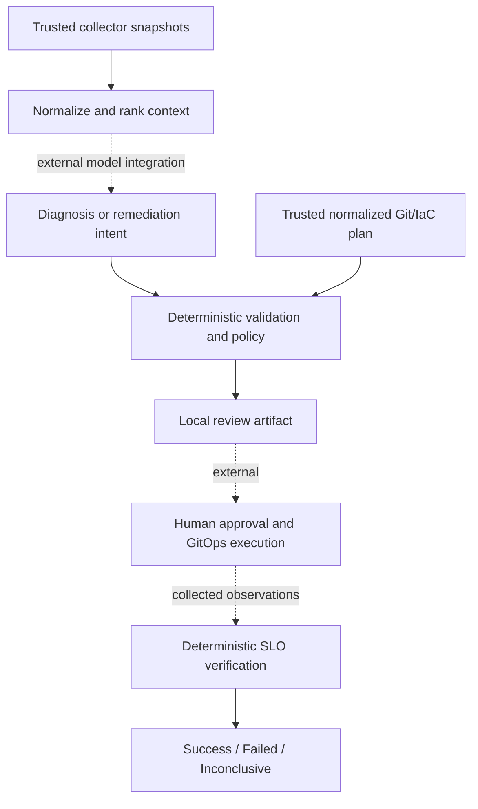

# Architecture and safety

[Back to README](../README.md)

The project is a local reference implementation for reviewing AI-proposed incident
remediation. It consumes structured JSON; it does not call an LLM, query live
observability systems, or execute production changes.

## Implemented capabilities

| Stage | Capability | Guide |
| --- | --- | --- |
| 1 | Structured diagnosis validation and rollback policy | [Triage](01-stage-1-triage.md) |
| 2 | Read-only context normalization and evidence ranking | [Context](02-stage-2-context.md) |
| 3 | Remediation intents, risk checks, plan comparison, and review artifacts | [Remediation](03-stage-3-remediation.md) |
| 4 | Contract-based SLO verification and error-budget approval tiers | [Verification](04-stage-4-verification.md) |

## Safety model

- Collector input is read-only and normalized before it reaches a reasoning layer.
- Diagnoses are schema-validated before policy evaluation.
- Confidence below `0.80` is routed to investigation.
- Rollbacks require human approval and result in a GitOps change proposal, never a direct production action.
- Actions outside the permitted policy default to no change.

The application has no Kubernetes credentials, `kubectl` integration, or production
mutation capability. All supported change proposals require human approval.
Verification never initiates a rollback.

## Integration boundaries

Collectors must supply fresh, authenticated facts independently of model output.
The local CLIs cannot authenticate the provenance of files. An external approval
service must bind approval to the exact intent, context, plan, repository revision,
and verification contract, then submit changes through the owning controller.

Model invocation, live metrics queries, raw Terraform/Kubernetes plan adapters,
RBAC, authenticated approvals, PR creation, and controller execution are external
integration work. The architecture diagram shows where those systems would connect;
it does not imply those integrations are implemented.

See the [trust and integration contract](03-stage-3-remediation.md#trust-and-integration-contract)
for plan completeness and approval requirements. Successful mitigation is separate
from root-cause resolution and from meeting the service's long-term SLO; see the
[memory example](04-stage-4-verification.md).
