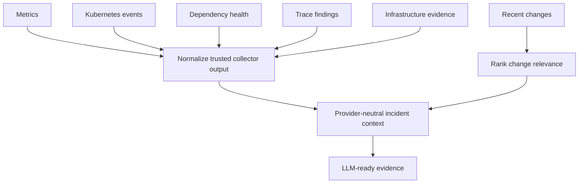

# Triage and incident context

[Back to README](../README.md)

Run all commands from the repository root with Python 3.11 or newer. Examples use local JSON fixtures and require no cloud credentials or model API key.

## Stage 1: triage and policy evaluation

```bash
PYTHONPATH=src python3 -m incident_copilot \
  --context examples/checkout_503_context.json \
  --diagnosis examples/checkout_503_diagnosis.json
```

The expected decision is `requires_human_approval`, with a proposed Git change to return `checkout-api` to `v2.18.4`.

## Stage 2: incident context and evidence

The context pipeline converts trusted collector output into compact, provider-neutral evidence for LLM reasoning. It normalizes metrics, Kubernetes events, dependency health, traces, infrastructure evidence, and recent changes.

```bash
PYTHONPATH=src python3 -m incident_copilot.context_cli \
  --input examples/checkout_incident_evidence.json
```

Recent changes are ranked by temporal proximity, dependency overlap, blast radius, and metric correlation. These scores indicate relevance for investigation; they do not establish causality.



Continue with [Stage 3: remediation proposals](remediation.md).
